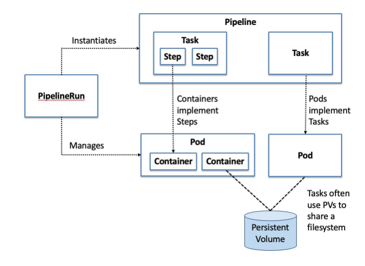

# Tekton Related Notes

## Tekton Introductions

**Tekton** 은 Kubernetes-native CI/CD 엔진이다. Kubernetes custom 리소스(`CustomerResourceDefinitions`/`CRDs`) 로 구성되어 있으며,

Tekton에서는 `Step`,`Task`,`Pipeline`,`TaskRun`,`PipelineRun` 등의 CRD를 사용한다.
여기서의 `Step` 은 하나의 *execution* (git checkout, test 등)을 뜻하며


`Step` 은 **컨테이너**와 매핑이되며,  `Task`는 **Pod**이랑 매핑이 된다.
`Pipeline` 은 `Task` 의 Ordering이라고 보면 되며 *jenkins build* 와 유사하다고 볼 수 있다.

각 `Step`에서 필요한 정보 (예: git, docker registry)는 `PipelineResource`로 생성된다.

장점:
 - 모든 리소스가 cluster에 배포되어 있어 배포 리소스를 효율적으로 활용할 수 있다

Pipelines are entities that group a series of Tasks that accomplish a specific build or delivery goal. 
Pipelines can be triggered by an event or invoked from a PipelineRun entity. 
Tasks can be simply sequentially ordered or organized into a Directed Acyclic Graph (DAG).




## Tekton Installation


### Install Tekton 
Installing Tekton Pipelines on Kubernetes
To install Tekton Pipelines on a Kubernetes cluster:

Run the following command to install Tekton Pipelines and its dependencies:

```shell
kubectl apply --filename https://storage.googleapis.com/tekton-releases/pipeline/latest/release.yaml
```
위와 같이 `tekton pipeline`을 설치하면 아래와 같은 리소스가 생긴다.

```bash
namespace/tekton-pipelines created
podsecuritypolicy.policy/tekton-pipelines created
clusterrole.rbac.authorization.k8s.io/tekton-pipelines-controller-cluster-access created
clusterrole.rbac.authorization.k8s.io/tekton-pipelines-controller-tenant-access created
clusterrole.rbac.authorization.k8s.io/tekton-pipelines-webhook-cluster-access created
clusterrole.rbac.authorization.k8s.io/tekton-pipelines-leader-election created
role.rbac.authorization.k8s.io/tekton-pipelines-controller created
role.rbac.authorization.k8s.io/tekton-pipelines-webhook created
serviceaccount/tekton-pipelines-controller created
serviceaccount/tekton-pipelines-webhook created
clusterrolebinding.rbac.authorization.k8s.io/tekton-pipelines-controller-cluster-access created
clusterrolebinding.rbac.authorization.k8s.io/tekton-pipelines-controller-leaderelection created
clusterrolebinding.rbac.authorization.k8s.io/tekton-pipelines-controller-tenant-access created
clusterrolebinding.rbac.authorization.k8s.io/tekton-pipelines-webhook-cluster-access created
clusterrolebinding.rbac.authorization.k8s.io/tekton-pipelines-webhook-leaderelection created
rolebinding.rbac.authorization.k8s.io/tekton-pipelines-controller created
rolebinding.rbac.authorization.k8s.io/tekton-pipelines-webhook created
customresourcedefinition.apiextensions.k8s.io/clustertasks.tekton.dev created
customresourcedefinition.apiextensions.k8s.io/conditions.tekton.dev created
customresourcedefinition.apiextensions.k8s.io/images.caching.internal.knative.dev created
customresourcedefinition.apiextensions.k8s.io/pipelines.tekton.dev created
customresourcedefinition.apiextensions.k8s.io/pipelineruns.tekton.dev created
customresourcedefinition.apiextensions.k8s.io/pipelineresources.tekton.dev created
customresourcedefinition.apiextensions.k8s.io/runs.tekton.dev created
customresourcedefinition.apiextensions.k8s.io/tasks.tekton.dev created
customresourcedefinition.apiextensions.k8s.io/taskruns.tekton.dev created
secret/webhook-certs created
validatingwebhookconfiguration.admissionregistration.k8s.io/validation.webhook.pipeline.tekton.dev created
mutatingwebhookconfiguration.admissionregistration.k8s.io/webhook.pipeline.tekton.dev created
validatingwebhookconfiguration.admissionregistration.k8s.io/config.webhook.pipeline.tekton.dev created
clusterrole.rbac.authorization.k8s.io/tekton-aggregate-edit created
clusterrole.rbac.authorization.k8s.io/tekton-aggregate-view created
configmap/config-artifact-bucket created
configmap/config-artifact-pvc created
configmap/config-defaults created
configmap/feature-flags created
configmap/config-leader-election created
configmap/config-logging created
configmap/config-observability created
deployment.apps/tekton-pipelines-controller created
service/tekton-pipelines-controller created
deployment.apps/tekton-pipelines-webhook created
service/tekton-pipelines-webhook created
```
### Install Tekton CLI
[https://github.com/tektoncd/cli](https://github.com/tekton cd/cli)
```bash
curl -LO https://github.com/tektoncd/cli/releases/download/v0.11.0/tkn_0.11.0_Linux_x86_64.tar.gz
tar xvzf tkn_0.11.0_Linux_x86_64.tar.gz -C /usr/local/bin/ tkn

# Completion 추가
source <(tkn completion bash)

```
### Install Tekton UI

Refer to [Tekton Dashboard](tekton-dashboard-release.yaml)

###### References
[Introduction to Tekton architecture and design](https://developer.ibm.com/devpractices/devops/articles/introduction-to-tekton-architecture-and-design/)